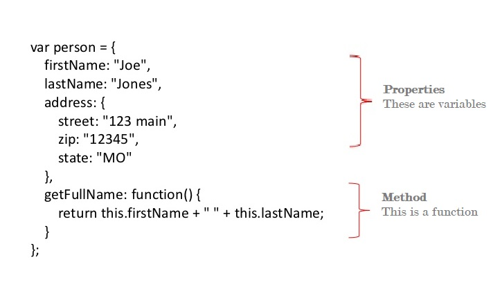
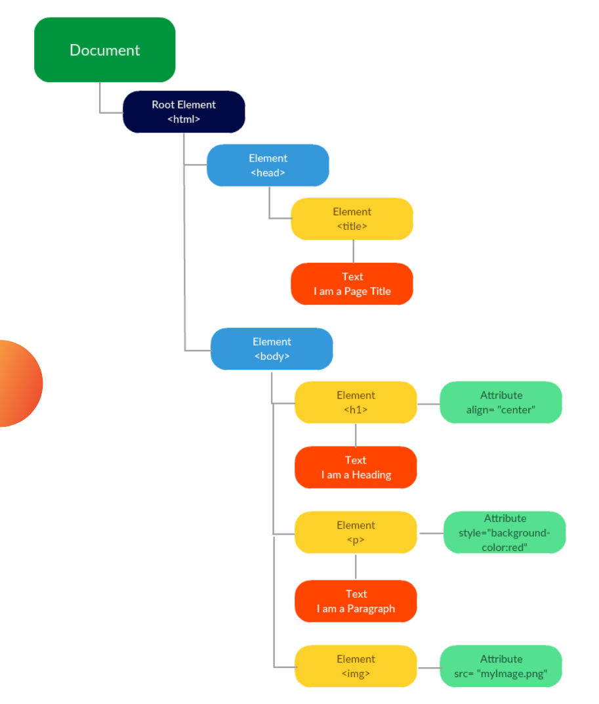
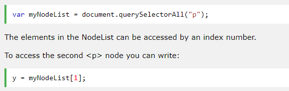
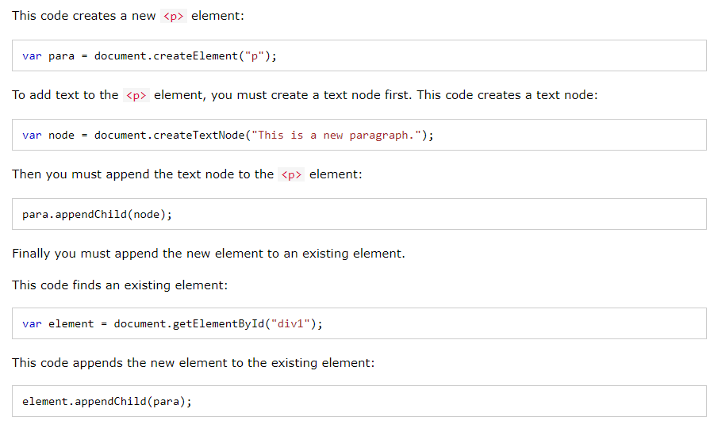

#  JS Object Literals and The DOM

## Objects :

**WHAT IS AN OBJECT?**

*Objects group together a set of variables and functions to create a model of a something you would recognize from the real world. In an object, variables and functions take on new names.*

> IN AN OBJECT: VARIABLES BECOME KNOWN AS PROPERTIES

> IN AN OBJECT: FUNCTIONS BECOME KNOWN AS METHODS 

**The this Keyword**

- In a function definition, this refers to the "owner" of the function.

- In the example above, this is the person object that "owns" the fullName function.

- In other words, this.firstName means the firstName property of this object.

## Document Object Model :

*The Document Object Model (DOM) specifies how browsers should create a model of an HTML page and how JavaScript can access and update the contents of a web page while it is in the browser window.*

**DOM Tree**

> DOM trees have four types of nodes: document nodes, element nodes, attribute nodes, and text nodes. 

**Finding HTML Elements**

*Often, with JavaScript, you want to manipulate HTML elements.*

*To do so, you have to find the elements first. There are several ways to do this:*

- Finding HTML elements by id
- Finding HTML elements by tag name
- Finding HTML elements by class name
- Finding HTML elements by CSS selectors
- Finding HTML elements by HTML object collections

**The HTML DOM NodeList Object**

- A NodeList object is a list (collection) of nodes extracted from a document.

- A NodeList object is almost the same as an HTMLCollection object.

- Some (older) browsers return a NodeList object instead of an HTMLCollection for methods like getElementsByClassName().

- All browsers return a NodeList object for the property childNodes. 

- Most browsers return a NodeList object for the method querySelectorAll().

**EXAMPLE**

---

# THE END 
