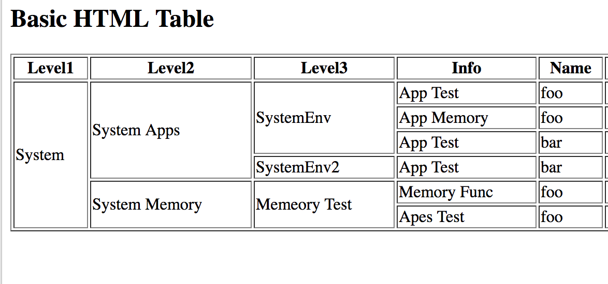
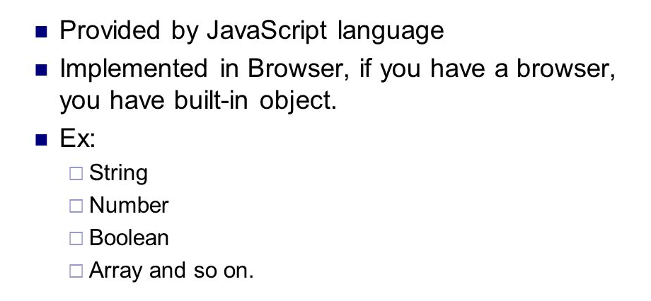

# Object-Oriented Programming, HTML Tables

## HTML Tables :

*HTML tables allow web developers to arrange data into rows and columns.*

**Define an HTML Table**

- The < table> tag defines an HTML table.

- Each table row is defined with a < tr> tag. Each table header is defined with a < th> tag. Each table data/cell is defined with a < td> tag.

- By default, the text in < th> elements are bold and centered.

- By default, the text in < td> elements are regular and left-aligned.

**Information**

- Use the HTML < table> element to define a table
- Use the HTML < tr> element to define a table row
- Use the HTML < td> element to define a table data
- Use the HTML < th> element to define a table heading
- Use the HTML < caption> element to define a table caption
- Use the colspan attribute to make a cell span many columns
- Use the rowspan attribute to make a cell span many rows
- Use the id attribute to uniquely define one table

## Functions, Methods, and Objects

**Object as constructor function**

*Perhaps the simplest to make sense of is the class-as-function model. One advantage is that variables defined with `var` will be kept private and inaccessible from outside the class:*

**The this Keyword**

- In a function definition, this refers to the "owner" of the function.

- In the example above, this is the person object that "owns" the fullName function.

- In other words, this.firstName means the firstName property of this object.

**Literal notation**

*Using literal (:) notation we can only ever have a single instance of our class. There is no constructor as such, so we need an `init()` method to serve that purpose:*

**Built-in Object**

> **Arrays and objects can be used to create complex data sets (and both can contain the other).**

# Domain Modeling

*Domain modeling is the process of creating a conceptual model for a specific problem. And a domain model that's articulated well can verify and validate your understanding of that problem.*

*Here's some tips to follow when building your own domain models.*

+ When modeling a single entity that'll have many instances, build self-contained objects with the same attributes and behaviors.
+ Model its attributes with a constructor function that defines and initializes properties.
+ Model its behaviors with small methods that focus on doing one job well.
+ Create instances using the `new` keyword followed by a call to a constructor function.
+ Store the newly created object in a variable so you can access its properties and methods from outside.
+ Use the `this` variable within methods so you can access the object's properties and methods from inside.

# THE END