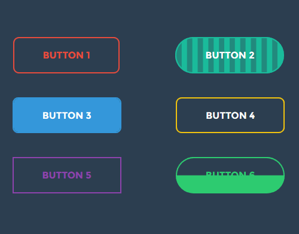

# CSS Transforms, Transitions, and Animations 

## CSS Transforms 

**Definition**

*The transform property applies a `2D` or `3D` transformation to an element. This property allows you to rotate, scale, move, skew, etc., elements.*

**Syntax**

**CSS 2D Transforms Methods**

*With the CSS transform property you can use the following 2D transformation methods:*

- `translate()`
- `rotate()`
- `scaleX()`
- `scaleY()`
- `scale()`
- `skewX()`
- `skewY()`
- `skew()`
- `matrix()`

**CSS 3D Transforms Methods**

*With the CSS transform property you can use the following 3D transformation methods:*

- `rotateX()`
- `rotateY()`
- `rotateZ()`

## Transitions & Animations

*CSS transitions allows you to change property values smoothly, over a given duration*

**Transitions Properties :**

- `transition`
- `transition-delay`
- `transition-duration`
- `transition-property`
- `transition-timing-function`

**How to Use CSS Transitions?**

*To create a transition effect, you must specify two things:*

> the CSS property you want to add an effect to

> the duration of the effect

## CSS Animations

*CSS allows animation of HTML elements without using JavaScript or Flash!*

**Animation Properties :**

- `@keyframes`
- `animation-name`
- `animation-duration`
- `animation-delay`
- `animation-iteration-count`
- `animation-direction`
- `animation-timing-function`
- `animation-fill-mode`
- `animation-`

**What are CSS Animations?**

- An animation lets an element gradually change from one style to another.

- You can change as many CSS properties you want, as many times you want.

- To use CSS animation, you must first specify some keyframes for the animation.

- Keyframes hold what styles the element will have at certain times.

## 8 simple CSS3 transitions that will wow your users

*Here are 8 really simple effects that will add life to your UI and smiles to your users’ faces.*

1. Fade in.
2. Change color.
3. Grow & Shrink.
4. Rotate elements.
5. Square to circle.
6. 3D shadow.
7. Swing.
8. Inset border.

## 6 Buttons animated

## CSS3 Animations: Keyframes 

**The @keyframes Rule**

*When you specify CSS styles inside the `@keyframes` rule, the animation will gradually change from the current style to the new style at certain times.*

*To get an animation to work, you must bind the animation to an element.*

# THE END 
